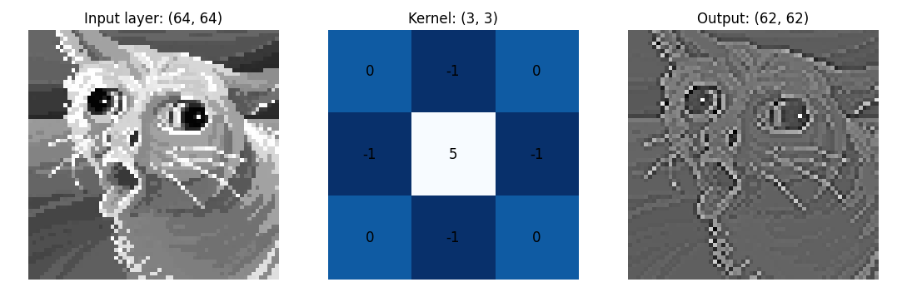

# NumPy-Conv2D

This repository provides an implementation of a Conv2D (2D convolutional layer) from scratch using NumPy. It is designed to be beginner-friendly, making it easy for newcomers to deep learning to understand the underlying concepts of convolutional neural networks. By leveraging the power of NumPy, this implementation offers an accessible entry point for those interested in studying and experimenting with convolutional layers.

## Features

- 2D convolutional layer implementation
- Support for both single-channel and multi-channel images/feature maps
- Customizable filter size, stride, and padding
- Efficient computation using NumPy

## Dependencies and Installation
- Python 3.11.2 

- Install requirements: `pip install -r requirements.txt`

## Implementation
```py
def conv2d(
    image: np.ndarray,
    in_channels: int,
    out_channels: int,
    kernel_size,
    stride=1,
    padding=0,
) -> np.ndarray:
    """python
    Perform a 2D convolution operation.

    Args:
        image (np.ndarray): Input image.
        in_channels (int): Number of input channels.
        out_channels (int): Number of output channels.
        kernel_size (int or tuple[int, int]): Size of the convolutional kernel.
        stride (int, optional): Stride value for the convolution operation. Default is 1.
        padding (int, optional): Padding value for the input image. Default is 0.

    Returns:
        np.ndarray: Resulting output of the convolution operation.

    Raises:
        TypeError: If `image` is not of type `numpy.ndarray`.
        TypeError: If `in_channels` is not of type `int`.
        TypeError: If `out_channels` is not of type `int`.
        ValueError: If `kernel_size` is invalid.

    """
```

## Understanding 2D Convolution

### Terminology

|Terms|Explainations   |Variables   |
|---|---|---|
|__input__|An image of size (`height`, `width`, `channels`) represents a single instance of an image. It can be thought of as a collection of `channels` 2D matrices, each of size (`height`, `width`), stacked together.|`in_channel`=`channels`|
|__padding__|Technique of adding extra border elements to the __input__ data before applying a __convolution__ operation. It helps preserve spatial dimensions and prevents the __output__ from being smaller than the __input__.|`padding`|
|__kernel__|A kernel, in the form of a 2D matrix of weights, is a small filter typically sized as (3, 3), (5, 5), or (7, 7). It plays a crucial role in the convolutional layer by learning and extracting features from the input data. The kernel is convolved over the __input__ with a specified __stride__, and at each position, the convolution operation is performed. The number of __kernel__ matrices is equivalent to the number of __output__ channels.|`kernel_size`, `stride`|
|__convolution__|The main operation in a 2D Convolution, but is is technically __cross correlation__. Mathematically __convolution__ and __cross correlation__ is similar operations as they are both performing element-wise dot product (multiplication and summation) between a kernel and a receptive field of the input.|
|__bias__|A set of 1D vectors of size __output_channels__ representing the bias terms. Each intermidiate outputs of each covolution operation on each `channels` of the input are summed together and added a __bias__ to introduce an offset or shift in the __output__ (__feature maps__).|
|__ouput__| Also called __feature maps__ is the result obtained after applying convolutional operations to the input data. Each feature map represents a specific learned feature or pattern detected by the convolutional layer.|`out_channels`|
### Output Sizing Calculation
```py
#Output height and width are calculated 
output_height = (input_height - kernel_height + 2 * padding) / stride + 1
output_width = (input_width - kernel_width + 2 * padding) / stride + 1
```

### Examples of an intermediate output
Input layer is the Red of the `input`. Arguments `kernel_size` = 3, `stride` = 1, `padding` = 0



## Results of 2D Convolution 

|2 `conv2d` layers|4 `conv2d` layers|
|:---:|:---:|
|`kernel_size` = 3, `stride` = 1, `padding` = 0|`kernel_size` = 3, `stride` = 1, `padding` = 1|
|||


## More on this topic
- [CNN Explainer](https://poloclub.github.io/cnn-explainer/)
- [PyTorch Conv2D](https://pytorch.org/docs/stable/generated/torch.nn.Conv2d.html)

