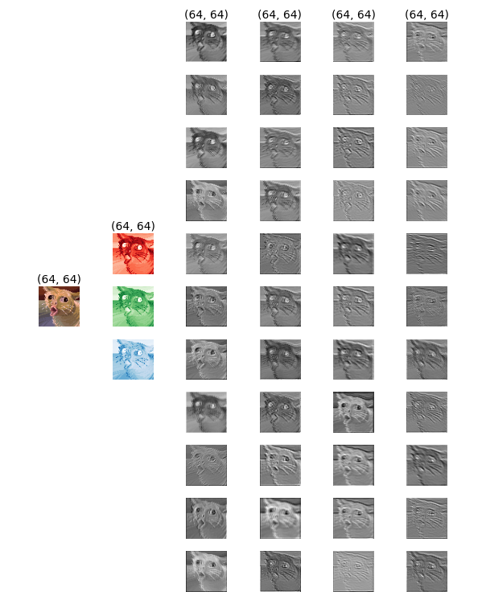

# NumPy-Conv2D

This repository provides an implementation of a Conv2D (2D convolutional layer) from scratch using NumPy. It is designed to be beginner-friendly, making it easy for newcomers to deep learning to understand the underlying concepts of convolutional neural networks. By leveraging the power of NumPy, this implementation offers an accessible entry point for those interested in studying and experimenting with convolutional layers.

## Features

- 2D convolutional layer implementation
- Support for both single-channel and multi-channel images/feature maps
- Customizable filter size, stride, and padding
- Efficient computation using NumPy

## Dependencies and Installation
- Python 3.11.2 

Install requirements

`pip install -r requirements.txt`

## Usage
```bash
def conv2d(
    image: np.ndarray, 
    in_channels: int,
    out_channels: int,
    kernel_size,
    stride=1,
    padding=0,
) -> np.ndarray:
    """
    Perform a 2D convolution operation.

    Args:
        image (np.ndarray): Input image
        kernel_size (int or tuple[int, int]): Size of the convolutional kernel.
        stride (int, optional): Default is 1.
        padding (int, optional): Default is 0.

    Returns:
        None
    """
```

## Understanding 2D Convolution
1. Input
1. Kernel
2. Bias
3. Output 

5. 1D Convolutional
    - input_size = (64, 64)
    - kernel_size = (3, 3)
    - stride = 1
    - padding = 0
    - output_size = (62, 62)

- Formula to calculate output size: 

$$output\_height = \frac{{input\_height - kernel\_size + 2 \times padding}}{{stride}} + 1$$

$$output\_width = \frac{{input\_width - kernel\_size + 2 \times padding}}{{stride}} + 1$$


6. 2D Convolutional

From left to right:

- Input image --> Input image channles --> Output of 1st conv2d --> Ouput of 2nd conv2d




|3 `conv2d` layers|5 `conv2d` layers|
|:---:|:---:|
|||
|  |  |


## More on this topic
- [CNN Explainer](https://poloclub.github.io/cnn-explainer/)
- [PyTorch Conv2D](https://pytorch.org/docs/stable/generated/torch.nn.Conv2d.html)

